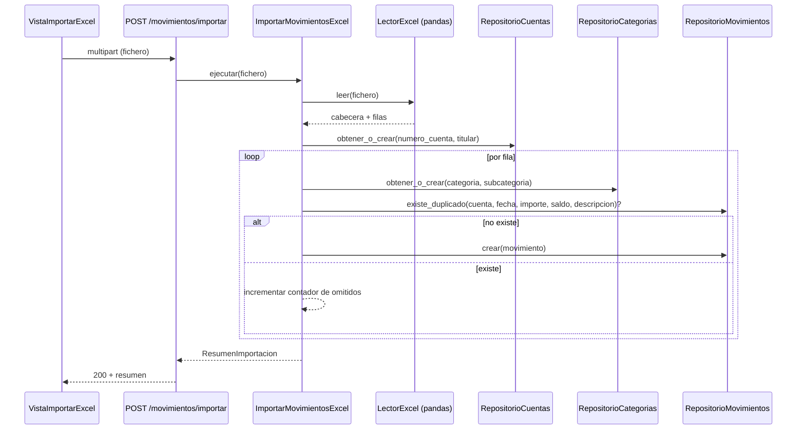

# Diseño: Gestión de Cuentas y Movimientos

## Enfoque técnico

Cuatro agregados independientes (`CuentaBancaria`, `Categoria` con
`Subcategoria` hija, `Movimiento`) siguiendo el mismo patrón hexagonal ya
esbozado en el proyecto: entidad + puerto de repositorio en `dominio/`, casos
de uso en `aplicacion/`, adaptador SQLAlchemy + parser Excel en
`infraestructura/`, routers/esquemas FastAPI en `interfaces/`. La importación
de Excel es un caso de uso de aplicación que orquesta los cuatro repositorios,
no una entidad nueva.

## Decisiones de arquitectura

| Decisión | Alternativas | Elección y motivo |
|---|---|---|
| Reglas "no borrar si tiene hijos" | (a) Confiar en `ON DELETE RESTRICT` de MySQL (b) Comprobar en el caso de uso | **(b)** — arroja `EntidadConDependenciasError` (dominio) con mensaje claro; el FK de BD queda como red de seguridad, no como mecanismo de negocio |
| Deduplicación de movimientos | (a) Constraint UNIQUE en BD (b) Comprobación en el caso de uso antes de insertar | **(b)** — permite devolver un recuento de omitidos en el resumen, algo que un `IntegrityError` no permite de forma limpia; se añade además un índice (no único) para que la consulta de comprobación sea rápida |
| Lectura de .xls y .xlsx | Una sola librería | `pandas.read_excel` con `engine="xlrd"` para `.xls` y `engine="openpyxl"` para `.xlsx`, elegido por extensión en el adaptador |
| Localización de cabecera de columnas | Fila fija (índice 3) | Búsqueda de la primera fila cuyo contenido, normalizado (mayúsculas, sin tildes), incluya `FECHA DE VALOR`/`F. VALOR`, `CATEGORIA`, `IMPORTE`; si no se encuentra, error de dominio `CabeceraNoReconocidaError` |

## Esquema de base de datos (una migración Alembic aditiva)

```
cuentas_bancarias        categorias                subcategorias                 movimientos
├ id PK                  ├ id PK                    ├ id PK                       ├ id PK
├ numero_cuenta UNIQUE    ├ nombre UNIQUE            ├ nombre                      ├ cuenta_id FK→cuentas_bancarias
├ alias NULL              └ ...                      ├ categoria_id FK→categorias  ├ categoria_id FK→categorias
├ entidad_bancaria NULL                               ├ UNIQUE(categoria_id,nombre)├ subcategoria_id FK NULL→subcategorias
├ moneda NULL                                                                     ├ fecha_valor DATE
└ titular NULL                                                                    ├ descripcion TEXT
                                                                                   ├ comentario TEXT NULL
                                                                                   ├ importe NUMERIC(12,2)
                                                                                   ├ saldo NUMERIC(12,2)
                                                                                   └ INDEX(cuenta_id, fecha_valor, importe, saldo, descripcion)  ← dedup
```

`Movimiento.categoria_id`/`subcategoria_id`/`cuenta_id` sin `ondelete`
(RESTRICT por defecto de MySQL), coherente con la decisión de arriba.

## Estructura de módulos (backend)

```
dominio/{cuenta,categoria,movimiento}/
  entidades.py        # dataclasses: CuentaBancaria, Categoria, Subcategoria, Movimiento
  repositorio.py       # Protocol: RepositorioCuentas / RepositorioCategorias / RepositorioMovimientos
  excepciones.py        # EntidadConDependenciasError, EntidadNoEncontradaError, NombreDuplicadoError
aplicacion/{cuenta,categoria,movimiento}/
  crear_x.py, listar_x.py, actualizar_x.py, eliminar_x.py   # un caso de uso por operación
aplicacion/importacion/
  importar_movimientos_excel.py   # orquesta los 3 repositorios + puerto LectorExcel
dominio/importacion/
  lector_excel.py   # Protocol LectorExcel (puerto), ResultadoImportacion (value object)
infraestructura/persistencia/
  modelos.py                      # tablas SQLAlchemy
  repositorios/repositorio_*_sqlalchemy.py
infraestructura/importacion/
  lector_excel_pandas.py          # adaptador del puerto LectorExcel
interfaces/api/v1/enrutadores/{cuentas,categorias,movimientos}.py, importacion.py
interfaces/api/v1/esquemas/{cuenta,categoria,movimiento,importacion}.py
```

`LectorExcel` vive como puerto en `dominio/importacion/` (no en
`infraestructura/`) porque el caso de uso de aplicación depende de él por
abstracción, cumpliendo el contrato de `import-linter`.

## Endpoints REST

| Método | Ruta | Descripción |
|---|---|---|
| GET/POST | `/api/v1/cuentas` | listar / crear |
| PUT/DELETE | `/api/v1/cuentas/{id}` | actualizar / eliminar |
| GET/POST, PUT/DELETE | `/api/v1/categorias[/{id}]` | igual patrón |
| GET/POST, PUT/DELETE | `/api/v1/categorias/{id}/subcategorias[/{id}]` | anidado bajo su categoría |
| GET/POST, PUT/DELETE | `/api/v1/movimientos[/{id}]` | `GET` admite `?cuenta_id=` |
| POST | `/api/v1/movimientos/importar` (multipart) | devuelve `ResumenImportacion` |

Errores de dominio se traducen a HTTP en cada router: `EntidadConDependenciasError`→409,
`NombreDuplicadoError`→409, `EntidadNoEncontradaError`→404,
`CabeceraNoReconocidaError`/extensión inválida→422.

## Frontend

`vistas/VistaCuentas.vue`, `VistaCategorias.vue` (incluye gestión de
subcategorías anidada), `VistaMovimientos.vue`, `VistaImportarExcel.vue`
(input file + botón + tabla de resumen). Un store Pinia por entidad
(`stores/cuentas.ts`, `categorias.ts`, `movimientos.ts`) con acciones
CRUD sobre `api/cliente.ts`; `VistaImportarExcel` no necesita store propio,
llama directo al cliente API.

## Diagrama de secuencia — importación de Excel



## Testing

| Capa | Qué | Cómo |
|---|---|---|
| Unitario | Reglas de dominio (unicidad, dependencias), lógica de deduplicación | `pytest`, repos en memoria (fakes) |
| Integración | Repositorios SQLAlchemy contra MySQL real | `pytest` + contenedor MySQL de test |
| BDD | Los 4 dominios de spec, en español | `.feature` en `tests/bdd/caracteristicas/`, incluyendo el Excel real de ejemplo copiado a `backend/tests/fixtures/` |
| Contrato | Nuevos endpoints | Schemathesis, ya integrado |
| E2E | Cada vista CRUD + flujo de importación | Playwright; captura con `page.screenshot({ path: 'capturas/{feature}-{paso}.png' })` en frontend/e2e/capturas/ tras cada acción relevante (listado inicial, formulario relleno, tras guardar, resumen de importación); carpeta subida como artefacto en `e2e.yml` |

## Rollout

Migración aditiva única, sin backfill (no hay datos previos). Sin flags ni
fases: se despliega completa.

## Preguntas abiertas

Ninguna bloqueante.
