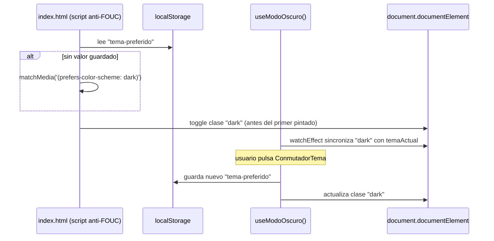
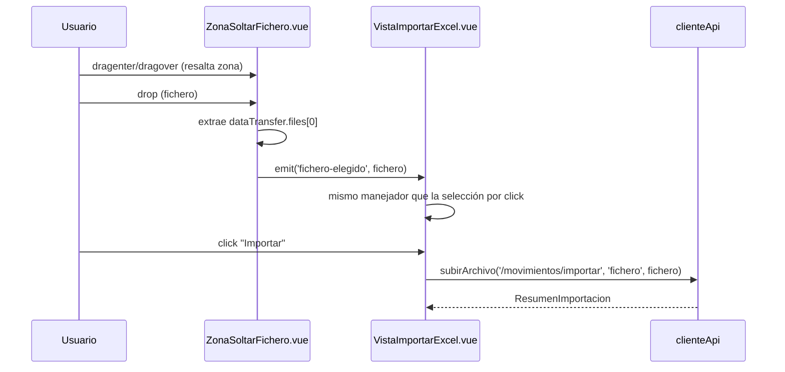

# Design: Rediseño de la interfaz con shadcn-vue sobre Reka UI

## Technical Approach

Adoptar shadcn-vue (componentes con código propio en el repo, construidos sobre las
primitivas headless de Reka UI) como capa de UI, sustituyendo el markup Tailwind
manual actual. El tema claro/oscuro y el estado del sidebar son estado de presentación
efímero (composables + `localStorage`), no dominio, por lo que no tocan los stores
Pinia existentes. Todas las vistas mantienen sus textos accesibles (placeholders,
nombres de botón) para no romper los tests E2E que dependen de ellos.

## Architecture Decisions

| Decisión | Elección | Alternativa descartada | Razón |
|---|---|---|---|
| Capa de componentes | shadcn-vue sobre Reka UI | Reka UI "a pelo" | Componentes ya accesibles y con dark mode de fábrica; menos trabajo manual, más consistencia |
| Iconos | `lucide-vue-next` | `@heroicons/vue` | Es la convención estándar junto a shadcn-vue |
| Estado de tema | Composable `useModoOscuro` (ref de módulo) + `localStorage` | Store Pinia | Es presentación, no dominio; evita acoplar UI a la capa de stores |
| Tailwind sin config JS | Tokens vía `@theme`/`:root`/`.dark` en `main.css` | `tailwind.config.js` con `darkMode` | El proyecto ya usa Tailwind v4 CSS-first; introducir un config JS sería un paso atrás |
| Alias de componentes | `@/componentes/ui` (en `components.json`) | `@/components/ui` (por defecto) | Respeta la convención en español ya establecida en el repo |
| `<select>` nativo → `Select` de Reka UI | Cada `Select` con `Label` propia (`Cuenta`, `Categoría`, `Subcategoría`) | Mantener `<select>` nativo | Necesario para el look shadcn-vue; de paso corrige el selector E2E frágil `select.nth(1)` |
| Input de fichero en drag&drop | `<input type="file">` oculto con `sr-only` dentro de `ZonaSoltarFichero.vue` | Eliminarlo y manejar solo `DataTransfer` | Preserva `setInputFiles()` de los tests E2E existentes sin reescribirlos |

## Data Flow

**Tema claro/oscuro:**


**Importación por arrastrar y soltar:**


## File Changes

| File | Action | Description |
|---|---|---|
| `frontend/components.json` | Create | Config shadcn-vue, alias `@/componentes/ui` |
| `frontend/src/lib/utils.ts` | Create | `cn()` (clsx + tailwind-merge) |
| `frontend/src/assets/main.css` | Modify | Tokens `oklch` en `:root`/`.dark`, `@theme inline`, `@custom-variant dark` |
| `frontend/index.html` | Modify | Script anti-FOUC inline |
| `frontend/src/composables/useModoOscuro.ts` | Create | Estado y persistencia del tema |
| `frontend/src/componentes/ui/{button,input,label,table,select,alert-dialog,tooltip,separator,sheet,card,sidebar}/` | Create | Componentes shadcn-vue copiados |
| `frontend/src/componentes/layout/{BarraLateral,BarraSuperior,ConmutadorTema}.vue` | Create | Composición propia del layout |
| `frontend/src/componentes/compartido/DialogoConfirmarEliminacion.vue` | Create | Confirmación de borrado reutilizable |
| `frontend/src/componentes/importacion/ZonaSoltarFichero.vue` | Create | Dropzone accesible |
| `frontend/src/App.vue` | Modify | `SidebarProvider`/`SidebarInset` + `BarraLateral`/`BarraSuperior` |
| `frontend/src/vistas/{VistaCuentas,VistaCategorias,VistaMovimientos,VistaImportarExcel}.vue` | Modify | Migración a nuevos componentes |
| `frontend/e2e/{cuentas,categorias,movimientos,importar-excel}.spec.ts` | Modify | Confirmación de borrado; `Select` accesible; test de drop |
| `frontend/e2e/{layout,accesibilidad}.spec.ts` | Create | Capturas de layout/tema; auditoría axe-core en 5 rutas |
| `frontend/package.json` | Modify | Nuevas dependencias |

## Interfaces / Contracts

```ts
// composables/useModoOscuro.ts
type Tema = 'claro' | 'oscuro'
function useModoOscuro(): { temaActual: Ref<Tema>; alternar: () => void }
```
`ZonaSoltarFichero.vue` — prop `ficheroSeleccionado: File | null`, evento
`fichero-elegido: [File]`. `DialogoConfirmarEliminacion.vue` — prop
`descripcion: string`, evento `confirmar: []`.

## Testing Strategy

| Layer | What to Test | Approach |
|---|---|---|
| Unit (Vitest) | `useModoOscuro` (persistencia, `matchMedia`), `ZonaSoltarFichero` (eventos drag/drop) | Mocks de `localStorage`/`matchMedia`/`DataTransfer` |
| E2E (Playwright) | Cada escenario Given/When/Then de las specs `interfaz` e `importacion-excel` (delta) | `test()` dedicado por escenario, capturas en `e2e/capturas/` |
| Accesibilidad | Las 5 rutas, claro y oscuro | `accesibilidad.spec.ts` con `@axe-core/playwright`, mismas `withTags`/`exclude` que hoy |

## Migration / Rollout

No requiere migración de datos. Cambio de sustitución de UI en una única rama/PR;
rollback = descartar rama o revertir el commit de merge.

## Open Questions

- [ ] Verificar en `pnpm dev`, tras copiar `Sidebar`, si `side="right"` requiere algún
      ajuste de clases en `Sidebar.vue`/`SidebarProvider.vue` de la versión concreta
      del registro shadcn-vue disponible en el momento de implementar.
