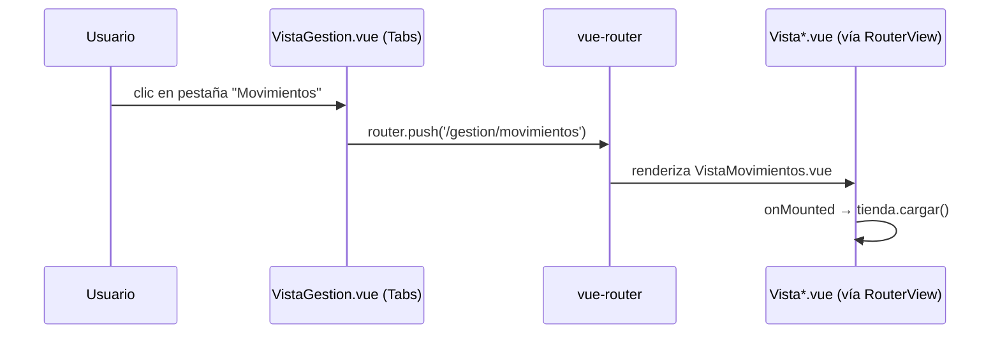
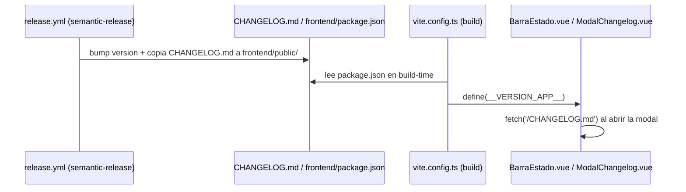

# Design: Navegación por pestañas, panel de edición deslizante y barra de estado

## Technical Approach

Reestructurar la navegación de nivel superior (rutas + sidebar) para agrupar
las 4 vistas de gestión bajo un único padre `/gestion` con pestañas, mover los
formularios de creación/edición a un `Sheet` ya disponible en el catálogo de
componentes, añadir selección múltiple a las dos tablas planas, y una barra de
estado global con versión (inyectada en build-time) y changelog (servido como
asset estático, sincronizado en cada release).

## Architecture Decisions

| Decisión | Elección | Alternativa descartada | Razón |
|---|---|---|---|
| Estructura de rutas de Gestión | Rutas hijas de `/gestion` (`/gestion/cuentas`, ...) + `RouterView` anidado | Un solo componente con `ref` de pestaña activa sin rutas propias | Mantiene deep-linking y recarga en la pestaña correcta (spec "la pestaña activa se refleja en la URL") |
| Contenido de las pestañas | `Tabs` solo como navegación visual; el contenido lo sigue resolviendo `RouterView` | `TabsContent` envolviendo cada vista | Evita duplicar el enrutado: la fuente de verdad de "qué se muestra" sigue siendo la ruta, no el estado del componente `Tabs` |
| Formulario de alta/edición | Un único `Sheet` reutilizado tanto para crear como para editar | Un `Sheet` para crear y un modal distinto para editar | Un solo patrón de interacción por entidad, más simple de mantener y de testear |
| Selección múltiple | Solo en Cuentas y Movimientos (tablas planas) | También en Categorías | Categorías es una jerarquía categoría→subcategorías; "seleccionar y borrar en bloque" no tiene una semántica clara ahí |
| Versión de la app | `frontend/package.json` sincronizado por `@semantic-release/npm` (`npmPublish:false`) e inyectado con `define` de Vite | Consultar la API de GitHub en runtime | Sin llamadas de red externas desde el cliente; la versión queda fijada en el build, igual que hace Docker Desktop |
| Changelog en la app | Copia estática `frontend/public/CHANGELOG.md`, sincronizada por el pipeline de release | Endpoint nuevo en el backend que lea el fichero del repo | El backend no tiene el repo completo en su contexto de build de Docker; añadirlo cruzaría capas sin necesidad para un contenido puramente de presentación |
| Botones Editar/Eliminar de fila | Icon-only con `aria-label` igual al texto anterior | Mantener texto | Aspecto más denso (Docker Desktop) sin romper accesibilidad ni los tests E2E que buscan por nombre accesible |

## Data Flow

**Navegación por pestañas (sin duplicar estado):**


**Versión y changelog:**


## File Changes

| File | Action | Description |
|---|---|---|
| `frontend/src/router/index.ts` | Modify | Rutas hijas bajo `/gestion` |
| `frontend/src/vistas/VistaGestion.vue` | Create | `Tabs` sincronizadas con la ruta + `RouterView` |
| `frontend/src/componentes/layout/BarraLateral.vue` | Modify | 2 secciones (Inicio, Gestión) |
| `frontend/src/componentes/layout/BarraEstado.vue` | Create | Versión + botón de changelog |
| `frontend/src/componentes/layout/ModalChangelog.vue` | Create | Fetch + render Markdown del changelog |
| `frontend/src/componentes/ui/tabs/*` | Create | `Tabs`/`TabsList`/`TabsTrigger`/`TabsContent` sobre Reka UI |
| `frontend/src/componentes/ui/checkbox/*` | Create | `Checkbox` sobre Reka UI |
| `frontend/src/componentes/ui/dialog/*` | Create | Modal centrada genérica sobre Reka UI |
| `frontend/src/vistas/VistaCuentas.vue` | Modify | Formulario en `Sheet`; selección múltiple; botones icon-only |
| `frontend/src/vistas/VistaMovimientos.vue` | Modify | Ídem |
| `frontend/src/vistas/VistaCategorias.vue` | Modify | Categoría en `Sheet`; restyle de tarjetas |
| `frontend/vite.config.ts`, `frontend/env.d.ts` | Modify | `define(__VERSION_APP__)` + tipado ambiental |
| `frontend/public/CHANGELOG.md` | Create | Copia inicial (se resincroniza en cada release) |
| `.releaserc.json` | Modify | `@semantic-release/npm`, `@semantic-release/exec`, nuevos `assets` en `@semantic-release/git` |
| `package.json` (raíz) | Modify | Nuevas devDependencies de semantic-release |
| `frontend/e2e/*.spec.ts` | Modify | Rutas `/gestion/...`; nuevos escenarios |

## Interfaces / Contracts

```ts
// vite.config.ts
define: { __VERSION_APP__: JSON.stringify(pkg.version) }

// env.d.ts (ambiental)
declare const __VERSION_APP__: string
```
`ModalChangelog.vue` — sin props; estado interno `contenidoMarkdown: Ref<string>`,
`cargando: Ref<boolean>`, `error: Ref<string | null>`.

## Testing Strategy

| Layer | What to Test | Approach |
|---|---|---|
| Unit (Vitest) | `ModalChangelog` (fetch OK/error), lógica de selección múltiple si se extrae a un composable | Mock de `fetch`; `@vue/test-utils` |
| E2E (Playwright) | Cada escenario Given/When/Then de la spec `interfaz` (delta) | Actualizar specs existentes (`/gestion/...`) + nuevos tests de pestañas, Sheet, selección en bloque y changelog |
| Accesibilidad | Rutas `/gestion/*` en vez de las antiguas | `accesibilidad.spec.ts` actualizado |

## Migration / Rollout

No requiere migración de datos. La versión mostrada será `0.0.0` hasta el
siguiente release real tras fusionar este cambio (limitación aceptada,
documentada en la propuesta).

## Open Questions

Ninguna bloqueante — decisiones de alcance (Categorías sin selección múltiple,
un solo `Sheet` para crear/editar) ya fijadas en la propuesta.
