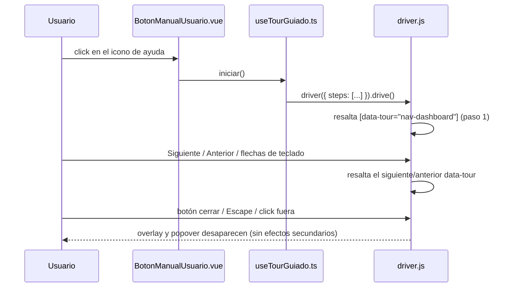

# Design: Manual de usuario interactivo

## Enfoque técnico

Un composable (`useTourGuiado`) construye una instancia de Driver.js con un
paso por cada elemento marcado `data-tour="..."` en el DOM ya renderizado
(panel lateral, conmutador de tema, icono de ayuda), y la expone vía
`iniciar()`. Un botón nuevo en `BarraSuperior.vue`, junto al conmutador de
tema, la invoca al pulsarlo. Cubre los 3 requisitos de la spec: lanzar bajo
demanda, recorrer las 6 secciones + tema + ayuda en orden, y accesibilidad
(Driver.js ya gestiona foco/teclado/Escape).

## Decisiones de arquitectura

| Decisión | Alternativas descartadas | Razón |
|---|---|---|
| Selectores por `data-tour="..."` | Seleccionar por texto visible (`aria-label`) o por clase CSS existente | El texto visible cambia con el copy; las clases CSS cambian con el rediseño visual. Un atributo dedicado solo para esto es estable ante ambos |
| Composable de módulo (`useTourGuiado.ts`), sin estado en Pinia | Store de Pinia para el estado del tour | El tour no tiene estado que otras partes de la app necesiten leer (a diferencia de `useModoOscuro`, cuyo tema sí lo lee `main.css`/otros componentes); un composable simple basta, mismo patrón ya usado para casos sin estado compartido |
| CSS propio sobre las clases de Driver.js en `main.css`, usando las variables oklch existentes | Aceptar el tema visual por defecto de `driver.js/dist/driver.css` | El tema por defecto de Driver.js es claro fijo; sin overrides, el popover sería ilegible en modo oscuro |
| Botón nuevo (`BotonManualUsuario.vue`) en vez de integrarlo dentro de `ConmutadorTema.vue` | Combinar ambos botones en un único componente | Mantiene cada componente con una sola responsabilidad (ya establecido en el proyecto: un componente, un botón, un propósito) |

## Flujo (Mermaid)



## Cambios de fichero

| Fichero | Acción | Descripción |
|---|---|---|
| `frontend/package.json` | Modificar | Añade dependencia `driver.js` |
| `frontend/src/composables/useTourGuiado.ts` | Crear | Pasos del tour + `iniciar()` |
| `frontend/src/componentes/layout/BotonManualUsuario.vue` | Crear | Botón icono (`CircleHelp`), mismo patrón que `ConmutadorTema.vue` |
| `frontend/src/componentes/layout/BarraSuperior.vue` | Modificar | Añade `<BotonManualUsuario />` junto a `<ConmutadorTema />` |
| `frontend/src/componentes/layout/BarraLateral.vue` | Modificar | `data-tour="nav-<seccion>"` en los 6 `RouterLink` de sección |
| `frontend/src/componentes/layout/ConmutadorTema.vue` | Modificar | `data-tour="conmutador-tema"` en el `Button` |
| `frontend/src/assets/main.css` | Modificar | Import de `driver.js/dist/driver.css` + overrides de tema |

## Interfaces / Contratos

```ts
// useTourGuiado.ts
import { driver, type DriveStep } from 'driver.js'

const pasos: DriveStep[] = [
  { element: '[data-tour="nav-dashboard"]', popover: { title: 'Dashboard', description: '…' } },
  { element: '[data-tour="nav-gestion"]', popover: { title: 'Gestión', description: '…' } },
  { element: '[data-tour="nav-importar"]', popover: { title: 'Importar', description: '…' } },
  { element: '[data-tour="nav-historial"]', popover: { title: 'Historial', description: '…' } },
  { element: '[data-tour="nav-resumen-anual"]', popover: { title: 'Resumen anual', description: '…' } },
  { element: '[data-tour="nav-administracion"]', popover: { title: 'Administración', description: '…' } },
  { element: '[data-tour="conmutador-tema"]', popover: { title: 'Tema claro/oscuro', description: '…' } },
  { element: '[data-tour="boton-manual-usuario"]', popover: { title: 'Ayuda', description: '…' } },
]

export function useTourGuiado() {
  function iniciar(): void {
    driver({
      showProgress: true,
      nextBtnText: 'Siguiente',
      prevBtnText: 'Anterior',
      doneBtnText: 'Terminar',
      steps: pasos,
    }).drive()
  }
  return { iniciar }
}
```

El panel lateral colapsado a solo-iconos sigue mostrando cada `RouterLink`
(con `tooltip`), así que `data-tour` sigue siendo localizable independientemente
de si el panel está expandido o colapsado; no requiere expandirlo antes de
lanzar el tour.

## Estrategia de pruebas

| Capa | Qué probar | Cómo |
|---|---|---|
| Unitario | `useTourGuiado` construye 8 pasos con los selectores correctos, en el orden de la spec | Vitest, sin montar Driver.js real (mock del import `driver.js`) |
| Unitario | `BotonManualUsuario.vue` llama a `iniciar()` al pulsar, tiene el `aria-label` correcto | Vitest + `@vue/test-utils` |
| E2E | Click en el icono lanza el tour y resalta el primer paso; Siguiente/Anterior recorren los 8 pasos en orden; Escape y click fuera cierran sin lanzarlo de nuevo al recargar | Playwright (`manual-usuario.spec.ts`) |
| E2E | Sin violaciones WCAG 2.1 AA con el tour abierto, en claro y oscuro | Ampliar `accesibilidad.spec.ts` con el tour activo |

## Migración / Despliegue

Ninguna. Cambio aditivo de frontend, sin migración de datos ni de API.

## Preguntas abiertas

Ninguna: alcance, librería y ubicación del botón ya confirmados con el
usuario.
