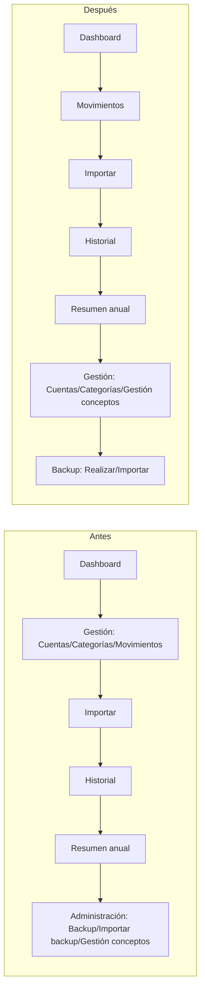

# Design: Reorganizar el menú lateral (Backup, Movimientos independiente, Gestión de conceptos en Gestión)

## Technical Approach

Reestructurar `router/index.ts` (nueva ruta top-level `/movimientos`, mover
`gestion-conceptos` bajo `/gestion`, renombrar `/administracion`→`/backup`),
propagar el renombrado a `VistaAdministracion.vue`→`VistaBackup.vue` y
`VistaGestion.vue`, reordenar y ampliar `BarraLateral.vue`, y sincronizar
`useTourGuiado.ts` con los nuevos nombres de ruta y `data-tour`. Sin cambios
de backend ni de librerías.

## Architecture Decisions

| Decisión | Elegido | Alternativa rechazada | Razón |
|---|---|---|---|
| Ruta de Movimientos | Top-level `/movimientos`, `VistaMovimientos.vue` directo (sin wrapper), igual que `/importar` | Mantenerla como hijo de `/gestion` con redirect | El usuario pide un ítem de menú independiente, no una sub-ruta |
| Ruta de Gestión de conceptos | Hija de `/gestion`: `/gestion/conceptos`, `name: 'gestion-conceptos'` | Ruta top-level propia | Conceptualmente es gestión de datos, coherente con Cuentas/Categorías |
| Ruta de Backup | `/backup`, hijos `/backup/realizar` (`backup-realizar`) y `/backup/importar` (`backup-importar`) | Mantener paths largos `backup/backup`, `backup/importar-backup` | Ya no hace falta el prefijo redundante al perder la 3ª pestaña |
| Componente contenedor | Renombrar fichero `VistaAdministracion.vue`→`VistaBackup.vue` | Mantener el nombre de fichero y solo cambiar el `<h2>` | El usuario confirmó rename completo (URL + ficheros) |

## File Changes

| File | Action | Description |
|------|--------|--------------|
| `frontend/src/router/index.ts` | Modify | `/movimientos` top-level; `/gestion` gana hijo `conceptos` (`gestion-conceptos`); `/administracion`→`/backup` con hijos `realizar`/`importar` |
| `frontend/src/vistas/VistaAdministracion.vue` | Rename → `VistaBackup.vue` | `pestanas`: solo `backup-realizar`→'Realizar backup', `backup-importar`→'Importar backup'; `PESTANA_POR_DEFECTO='backup-realizar'`; `<h2>Backup</h2>` |
| `frontend/src/vistas/VistaGestion.vue` | Modify | `pestanas`: `gestion-cuentas`, `gestion-categorias`, `gestion-conceptos`→'Gestión de conceptos' (quita `gestion-movimientos`) |
| `frontend/src/componentes/layout/BarraLateral.vue` | Modify | Ver detalle abajo |
| `frontend/src/composables/useTourGuiado.ts` | Modify | Ver detalle abajo |
| Tests unitarios y E2E listados abajo | Modify/Rename | Ver plan de tests |

### `BarraLateral.vue`

- Orden final de `<SidebarMenuItem>`/`<Collapsible>`: Dashboard, **Movimientos** (nuevo, ítem simple), Importar, Historial, Resumen anual, **Gestión** (bloque movido), **Backup** (renombrado, último).
- Nuevo ítem simple "Movimientos" (mismo patrón que Dashboard/Importar, líneas 158-169 actuales): `RouterLink to="/movimientos"`, `data-tour="nav-movimientos"`, icono `ArrowLeftRight` `text-rose-500` (el mismo que tenía en `subseccionesGestion`).
- `subseccionesGestion` pasa a `[Cuentas, Categorías, {a: '/gestion/conceptos', etiqueta: 'Gestión de conceptos', icono: Link2, color: 'text-teal-500'}]` (movido desde `subseccionesAdministracion`).
- `subseccionesAdministracion` → renombrado `subseccionesBackup`, queda `[{a: '/backup/realizar', etiqueta: 'Realizar backup', ...}, {a: '/backup/importar', etiqueta: 'Importar backup', ...}]`.
- `administracionActiva(path)` → `backupActiva(path)` = `path.startsWith('/backup')`; `gestionActiva` sin cambios.
- Refs: `administracionAbierta` → `backupAbierta`; `watch` actualizado con `backupActiva`.
- `data-tour="nav-administracion"` → `data-tour="nav-backup"`; tooltip/aria-labels "Administración"→"Backup".

### `useTourGuiado.ts`

```ts
type SeccionMenu = 'dashboard' | 'movimientos' | 'gestion' | 'importar' | 'historial' | 'resumen-anual' | 'backup'

SECCION_POR_RUTA = {
  inicio: 'dashboard',
  movimientos: 'movimientos',
  'gestion-cuentas': 'gestion', 'gestion-categorias': 'gestion', 'gestion-conceptos': 'gestion',
  importar: 'importar',
  historial: 'historial', 'historial-categoria': 'historial', 'historial-subcategoria': 'historial',
  'resumen-anual': 'resumen-anual',
  'backup-realizar': 'backup', 'backup-importar': 'backup',
}
```

Nuevas/actualizadas entradas en `ORIENTACION_POR_SECCION`:
- `movimientos`: `element: '[data-tour="nav-movimientos"]'`, título "Movimientos", descripción "Registra, edita y filtra tus movimientos de gastos e ingresos."
- `gestion`: descripción actualizada para mencionar conceptos: "Administra tus cuentas, categorías, y las asociaciones entre conceptos previstos y categorías reales."
- `backup`: `element: '[data-tour="nav-backup"]'`, título "Backup", descripción sin mención a conceptos: "Realiza copias de seguridad de tus datos o restaura una copia anterior."

## Data Flow



## Testing Strategy

| Capa | Fichero | Cambio |
|---|---|---|
| Unit | `VistaRealizarBackup.spec.ts`, `VistaImportarBackup.spec.ts` | mock `name` → `backup-realizar`/`backup-importar`; assert `nav-backup` |
| Unit | `VistaGestionConceptos.spec.ts` | mock `name` → `gestion-conceptos`; assert `nav-gestion` |
| Unit | `VistaMovimientos.spec.ts` | mock `name` → `movimientos`; assert `nav-movimientos` |
| Unit | `VistaCuentas.spec.ts`, `VistaCategorias.spec.ts` | Sin cambios (siguen en `gestion-*`/`nav-gestion`) |
| Unit | `useTourGuiado.spec.ts` | Tabla `it.each`: añade `['movimientos', 'nav-movimientos']`; `gestion-conceptos`→`nav-gestion`; `backup-*`→`nav-backup` |
| E2E | `administracion.spec.ts` → **rename** `backup.spec.ts` | Textos "Administración"→"Backup", rutas `/administracion/*`→`/backup/*`, solo 2 pestañas |
| E2E | `gestion-conceptos.spec.ts` | `/administracion/gestion-conceptos`→`/gestion/conceptos`; heading "Administración"→"Gestión" |
| E2E | `layout.spec.ts` | Nuevo test de orden de menú (Dashboard→Movimientos→...→Gestión→Backup) siguiendo el patrón del test existente "Importar es un acceso de primer nivel..."; elimina el test de pestaña "Movimientos" dentro de Gestión; `/gestion/movimientos`→`/movimientos` |
| E2E | `manual-usuario-paginas.spec.ts` | Test de Movimientos: header "Gestión"→"Movimientos", navega a `/movimientos`; tests de Backup: header "Administración"→"Backup"; test de Gestión de conceptos: navega a `/gestion/conceptos`, header "Gestión" |
| E2E | `historial.spec.ts` | `/administracion/gestion-conceptos`→`/gestion/conceptos`; heading "Administración"→"Gestión" |
| E2E | `accesibilidad.spec.ts` | Array `RUTAS`: `/gestion/movimientos`→`/movimientos`; tests de tour de Movimientos navegan a `/movimientos` |
| E2E | `movimientos.spec.ts` (23x), `categorias.spec.ts` (4x), `cuentas.spec.ts` (1x) | Reemplazo sistemático `/gestion/movimientos`→`/movimientos` |

## Migration / Rollout

No migración de datos. Cambio de rutas frontend puro; revertir el commit
restaura el árbol anterior sin efectos en datos persistidos.

## Open Questions

Ninguna — todas las decisiones de nombres de ruta y alcance del rename
quedaron confirmadas con el usuario antes de esta fase.
